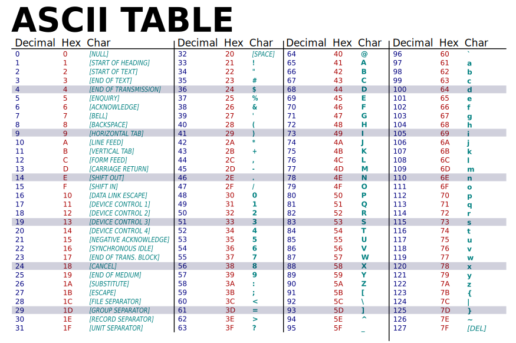

# System znaków ASCII i Unicode
## ASCII
ASCII (American Standard Code for Information Interchange) to standardowy system kodowania znaków używany w komputerach i urządzeniach komunikacyjnych. ASCII używa 7-bitowego kodowania, co pozwala na reprezentację 128 różnych znaków, w tym:
- Litery alfabetu łacińskiego (A-Z, a-z)
- Cyfry (0-9)
- Znaki interpunkcyjne (np. ., !, ?)
- Znaki kontrolne (np. \n, \t)
###  tabela ASCII

## Unicode
Unicode to bardziej zaawansowany system kodowania znaków, który ma na celu reprezentację wszystkich znaków używanych we wszystkich językach świata. Unicode używa różnych form kodowania, takich jak UTF-8, UTF-16 i UTF-32, co pozwala na reprezentację ponad miliona różnych znaków.
### Zalety Unicode:
- Obsługa wielu języków i alfabetów
- Kompatybilność z ASCII (UTF-8)
- Możliwość reprezentacji symboli i emotikonów
### Przykłady kodowania Unicode:
- `U+0041` - Litera "A"
- `U+03A3` - Grecka litera sigma "Σ"
- `U+1F600` - Emotikona "😀"
### Linki
- [Strona Unicode](https://home.unicode.org/)
- [Tabela Unicode](https://symbl.cc/en/unicode-table/)
## Podsumowanie
ASCII jest prostym i powszechnie używanym systemem kodowania znaków, ale jego ograniczenia sprawiają, że Unicode jest bardziej wszechstronny i przyszłościowy, zwłaszcza w kontekście globalizacji i różnorodności językowej.
